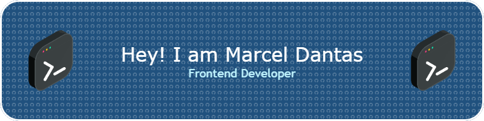

<h2> 💫 Little Bit More About Me 

🌱 I'm currently learning  <b>Context API</b> and <b>React Hooks</b>.

📫 How to reach me? <b><a href = "mailto: dantasmarcel.dev@gmail.com">dantasmarcel.dev@gmail.com</a></b>
<!-- 
🔭 I'm currently working on fdg

👯 I want to collaborate on ggh

🙏 I'm looking for help with ht
 -->
<!-- 
💬 Ask me about hd

I regularly write articles on <a href="fd">gdf</a>

All of my projects are available at <a href="dgbb">bdb</a>

Know about my experiences <a href="dgb">here</a>

⚡ Fun Fact: dgbd
 -->

<h2> 💻 Skills 

<!--  -->
<!--  -->
<!--  -->
<!--  -->
<!--  -->
<!--  -->

<h2> 👥 Connect With Me 

<h2> 📊 Github Status 

  
  

<!-- 

 -->